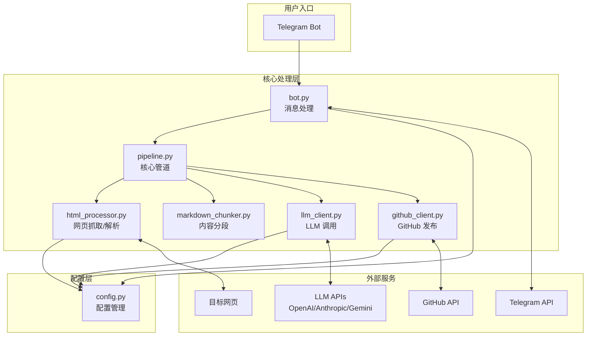

<!-- OPENSPEC:START -->
# OpenSpec Instructions

These instructions are for AI assistants working in this project.

Always open `@/openspec/AGENTS.md` when the request:
- Mentions planning or proposals (words like proposal, spec, change, plan)
- Introduces new capabilities, breaking changes, architecture shifts, or big performance/security work
- Sounds ambiguous and you need the authoritative spec before coding

Use `@/openspec/AGENTS.md` to learn:
- How to create and apply change proposals
- Spec format and conventions
- Project structure and guidelines

Keep this managed block so 'openspec update' can refresh the instructions.

<!-- OPENSPEC:END -->

---

# WebSum-To-Git 项目 AI 上下文

> **生成时间**: 2025-11-26T17:59:25+08:00
> **覆盖率**: 100%（8 核心模块 + 1 入口文件已全部扫描）

## 项目概述

**定位**：Telegram Bot 驱动的网页知识沉淀工具，将 HTML 网页自动总结为 Obsidian 友好的 Markdown 笔记并提交到 GitHub 仓库。

**核心流程**：
```
用户 → Telegram Bot → HTML 抓取 → LLM 总结 → Markdown 生成 → GitHub 发布
```

**技术栈**：
- **运行时**: Python 3.13 + UV 包管理
- **通信**: Telegram Bot API, GitHub API, 多厂商 LLM API (OpenAI/Anthropic/Gemini)
- **数据处理**: requests/Playwright, BeautifulSoup, readability-lxml, markdownify, tiktoken
- **工具链**: mypy (类型检查), ruff (代码检查/格式化)

## 架构图



## 模块索引

| 模块 | 路径 | 职责 | 行数 |
|------|------|------|------|
| **config** | `src/websum_to_git/config.py` | 配置模型定义与 YAML 加载 | 98 |
| **bot** | `src/websum_to_git/bot.py` | Telegram Bot 入口与消息处理 | 73 |
| **pipeline** | `src/websum_to_git/pipeline.py` | HTML→LLM→Markdown→GitHub 核心流程 | 150 |
| **html_processor** | `src/websum_to_git/html_processor.py` | 网页抓取(requests/Playwright)与解析 | 155 |
| **markdown_chunker** | `src/websum_to_git/markdown_chunker.py` | 基于 tiktoken 的 Markdown 分段 | 343 |
| **llm_client** | `src/websum_to_git/llm_client.py` | 多厂商 LLM 统一调用接口 | 146 |
| **github_client** | `src/websum_to_git/github_client.py` | GitHub API 文件发布 | 68 |
| **main** | `src/main.py` | CLI 入口点 | 30 |

**详细模块文档**: → [`src/websum_to_git/CLAUDE.md`](src/websum_to_git/CLAUDE.md)

## 快速参考

### 运行命令
```bash
# 开发环境启动
python src/main.py --config config.yaml

# Docker 启动
docker compose up --build -d

# 代码检查
uv run ruff check src/
uv run mypy src/
```

### 关键配置项 (config.yaml)
```yaml
telegram:
  bot_token: "xxx"          # 必填: Telegram Bot Token
llm:
  provider: openai          # openai | anthropic | gemini | openai-response
  api_key: "xxx"            # 必填: LLM API Key
  model: "gpt-4o"           # 必填: 模型名称
  base_url: null            # 可选: 自定义 API 端点
github:
  repo: "owner/repo"        # 必填: 目标仓库
  pat: "xxx"                # 必填: GitHub PAT
  branch: "main"            # 可选: 目标分支
  target_dir: "notes"       # 可选: 目标目录
http:
  fetch_mode: "requests"    # requests | headless
  verify_ssl: true
```

### 入口与调用链
```
main.py:main()
  └── bot.py:run_bot()
        └── TelegramBotApp.handle_message()
              └── pipeline.py:HtmlToObsidianPipeline.process_url()
                    ├── html_processor.py:fetch_html[_headless]()
                    ├── html_processor.py:parse_page()
                    ├── markdown_chunker.py:split_markdown_into_chunks()
                    ├── llm_client.py:LLMClient.generate()
                    └── github_client.py:GitHubPublisher.publish_markdown()
```

## 工程原则

本项目严格遵循：**KISS / YAGNI / DRY / SOLID**

- **KISS**: 模块划分清晰，每个模块只做一件事
- **YAGNI**: 只实现当前需求，不做未使用的泛化
- **DRY**: HTML 解析、LLM 调用、Git 操作分别封装
- **SOLID**: 单一职责 + 依赖倒置

## 危险操作约束

以下操作 **不得由 AI 自主发起**（详见 `AGENTS.md`）：
- Git commit/push/reset
- 文件删除/批量重命名
- 真实凭证修改

## 文档导航

| 文档 | 用途 |
|------|------|
| [`README.md`](README.md) | 项目总览与使用介绍 |
| [`AGENTS.md`](AGENTS.md) | AI/代理详细约定 |
| [`docs/quickstart.md`](docs/quickstart.md) | 新用户快速上手 |
| [`docs/development.md`](docs/development.md) | 开发者指南 |
| [`openspec/AGENTS.md`](openspec/AGENTS.md) | OpenSpec 框架说明 |
| [`src/websum_to_git/CLAUDE.md`](src/websum_to_git/CLAUDE.md) | 模块级详细文档 |