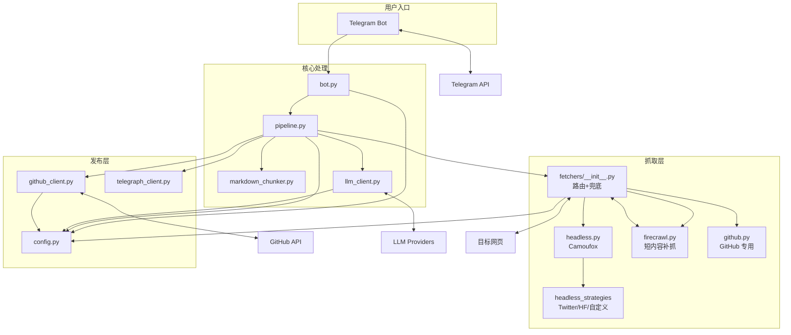

<!-- OPENSPEC:START -->
# OpenSpec Instructions

These instructions are for AI assistants working in this project.

Always open `@/openspec/AGENTS.md` when the request:
- Mentions planning or proposals (words like proposal, spec, change, plan)
- Introduces new capabilities, breaking changes, architecture shifts, or big performance/security work
- Sounds ambiguous and you need the authoritative spec before coding

Use `@/openspec/AGENTS.md` to learn:
- How to create and apply change proposals
- Spec format and conventions
- Project structure and guidelines

Keep this managed block so 'openspec update' can refresh the instructions.

<!-- OPENSPEC:END -->

---

# WebSum-To-Git 项目 AI 上下文

> **生成时间**: 2025-12-10T01:00:11+08:00
> **覆盖率**: 100%（核心模块 + Fetcher 策略 + 入口文件已检查）

## 项目概述

**定位**：Telegram Bot 驱动的网页知识沉淀工具，抓取网页 → AI 总结/翻译 → 生成 Obsidian Markdown → 发布到 GitHub，并可生成 Telegraph 预览与网页截图。

**核心流程**：用户发链接 → Bot 解析 → Fetchers 抓取（Headless + 策略；短内容可 Firecrawl 兜底） → LLM 总结/标签 → Markdown → GitHub 发布 → Telegraph 预览。

**技术栈**：
- 运行时：Python 3.13，python-telegram-bot，uv/requirements
- 抓取：Camoufox(Playwright Firefox)，Headless 策略注册表，Firecrawl（可选），PyGithub
- 数据处理：readability-lxml，BeautifulSoup，markdownify，tiktoken
- LLM：OpenAI / OpenAI-Response / Anthropic / Gemini（可启用 thinking）
- 工具链：pyright，ruff

## 架构图



## 模块索引

| 模块 | 路径 | 职责 | 行数 |
|------|------|------|------|
| config | `src/websum_to_git/config.py` | 配置加载，支持 fast_llm/firecrawl/http | 133 |
| bot | `src/websum_to_git/bot.py` | Telegram 入口，摘要、删除、截图 | 231 |
| pipeline | `src/websum_to_git/pipeline.py` | 抓取→摘要/翻译→Markdown→GitHub/Telegraph | 337 |
| fetchers 入口 | `src/websum_to_git/fetchers/__init__.py` | 显式路由、Headless 兜底、Firecrawl 回退 | 116 |
| headless+策略 | `fetchers/headless.py` + `fetchers/headless_strategies/*` | Camoufox 抓取 + Twitter/HF 等策略注册表 | 478 |
| github fetcher | `src/websum_to_git/fetchers/github.py` | 仓库/Issue/PR/文件/Gist 抓取 | 362 |
| firecrawl | `src/websum_to_git/fetchers/firecrawl.py` | Firecrawl API 补抓 | 75 |
| screenshot | `src/websum_to_git/fetchers/screenshot.py` | Camoufox 网页截图 | 81 |
| markdown_chunker | `src/websum_to_git/markdown_chunker.py` | Markdown 结构化分段/token 估算 | 380 |
| llm_client | `src/websum_to_git/llm_client.py` | OpenAI/Anthropic/Gemini 封装 | 190 |
| github_client | `src/websum_to_git/github_client.py` | 发布/删除 GitHub 文件 | 118 |
| telegraph_client | `src/websum_to_git/telegraph_client.py` | Telegraph 匿名发布 | 204 |
| main | `src/main.py` | CLI 入口 | 30 |

**详细模块文档**: → `src/websum_to_git/CLAUDE.md`

**Bot 能力速览**：
- 发送 URL 自动抓取+摘要+发布，消息附带删除按钮
- `/url2img <url>` 使用 Camoufox 全页截图
- `/start` `/help` 基础引导；心跳文件 `/tmp/websum_bot_heartbeat` 便于健康检查

## 快速参考

### 运行命令
```bash
# 开发环境启动
python src/main.py --config config.yaml

# Docker 启动
docker compose up --build -d

# 代码检查
uv run ruff check src/
uv run pyright 
```

### 关键配置项 (config.yaml)
```yaml
telegram:
  bot_token: "xxx"          # 必填: Telegram Bot Token
llm:
  provider: openai          # openai | openai-response | anthropic | gemini
  api_key: "xxx"
  model: "gpt-4.1-mini"
  base_url: null            # openai/openai-response 默认 https://api.openai.com
  enable_thinking: true     # 支持时启用 thinking
  max_input_tokens: 10000   # 单次上下文 token 限制
llm_fast:
  provider: openai          # 可选: 快速模型，用于标签/翻译
  base_url: "https://fast-llm.example.com"
  api_key: "xxx"
  model: "gpt-4o-mini"
  enable_thinking: false
  max_input_tokens: 8000
github:
  repo: "owner/repo"        # 必填: 目标仓库
  pat: "xxx"                # 必填: GitHub PAT
  branch: "main"            # 可选: 目标分支
  target_dir: "notes"       # 可选: 目标目录
firecrawl:
  api_key: "xxx"            # 可选: 兜底抓取
http:
  verify_ssl: true          # 抓取时是否校验证书
```

### 入口与调用链
```
main.py:main()
  └── bot.py:run_bot()
        └── TelegramBotApp.handle_message() / url2img / delete
              └── pipeline.HtmlToObsidianPipeline.process_url()
                    ├── fetchers.fetch_page(): GitHub 专用 → Headless 策略 → Firecrawl 兜底
                    ├── markdown_chunker.split_markdown_into_chunks()
                    ├── llm_client.LLMClient.generate()
                    ├── github_client.GitHubPublisher.publish_markdown()
                    └── telegraph_client.TelegraphClient.publish_markdown()
```

## Markdown 输出格式

- YAML front matter：source/created_at/tags 列表，保留原始标题。
- 摘要正文：`# {AI 标题}` 起始；内容过短时跳过 LLM，总览提示。
- 原文区：统一使用一级标题；非中文时先输出 `# 原文（中文翻译）`，分隔线后 `# 原文（原语言）`。

```markdown
---
source: https://example.com/article
created_at: 2025.12.10. 01:00
tags:
  - WebSum
  - AI
---

# AI 精炼标题
> 摘要段落...

---
# 原文（中文翻译）
...译文...

---
# 原文（原语言）
...原文...
```

## 工程原则

本项目严格遵循：**KISS / YAGNI / DRY / SOLID**

- **KISS**: 模块划分清晰，每个模块只做一件事
- **YAGNI**: 只实现当前需求，不做未使用的泛化
- **DRY**: HTML 解析、LLM 调用、Git 操作分别封装
- **SOLID**: 单一职责 + 依赖倒置

## 危险操作约束

以下操作 **不得由 AI 自主发起**（详见 `AGENTS.md`）：
- Git commit/push/reset
- 文件删除/批量重命名
- 真实凭证修改

## 文档导航

| 文档 | 用途 |
|------|------|
| [`README.md`](README.md) | 项目总览与使用介绍 |
| [`AGENTS.md`](AGENTS.md) | AI/代理详细约定 |
| [`docs/quickstart.md`](docs/quickstart.md) | 新用户快速上手 |
| [`docs/development.md`](docs/development.md) | 开发者指南 |
| [`openspec/AGENTS.md`](openspec/AGENTS.md) | OpenSpec 框架说明 |
| [`src/websum_to_git/CLAUDE.md`](src/websum_to_git/CLAUDE.md) | 模块级详细文档 |
