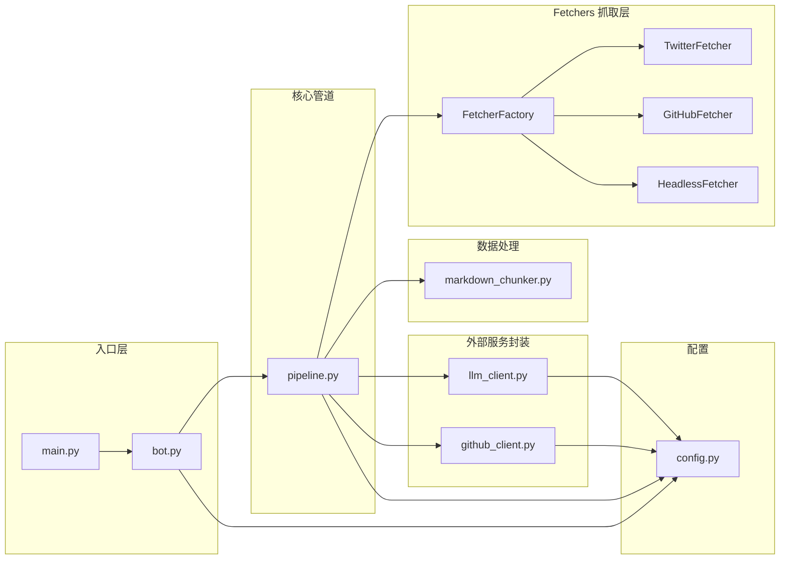
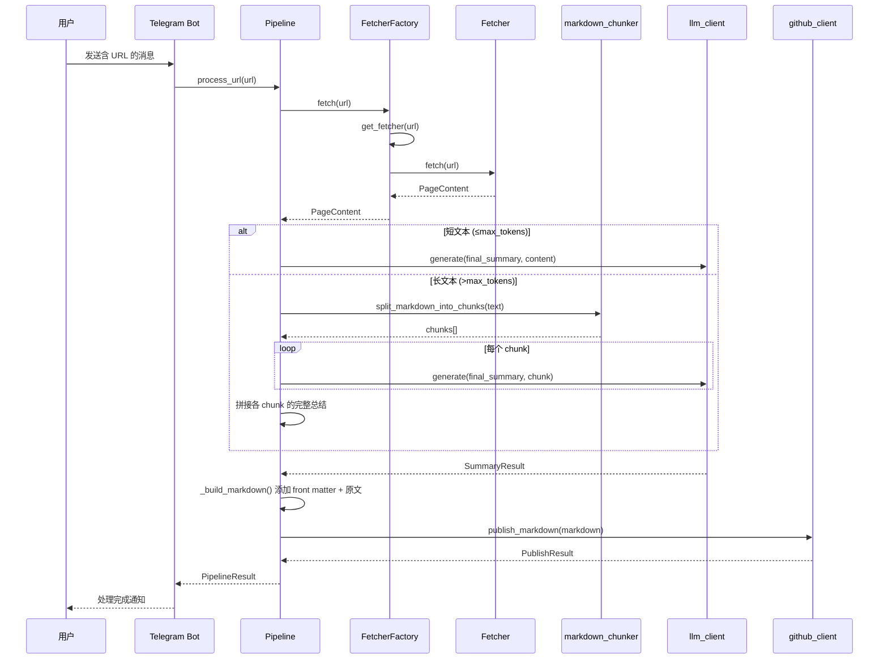

# websum_to_git 模块详细文档

> **导航**: [← 返回项目根目录 CLAUDE.md](../../CLAUDE.md)
> **更新时间**: 2025-12-08T00:00:00+08:00

本目录是 WebSum-To-Git 项目的核心 Python 包，包含所有业务逻辑模块。

---

## 模块概览



---

## 各模块详解

### 1. config.py - 配置管理

**职责**: 定义配置数据模型，从 YAML 文件加载并校验配置。

**关键导出**:
| 符号 | 类型 | 说明 |
|------|------|------|
| `LLMConfig` | dataclass | LLM 服务配置 (provider, api_key, model, base_url, enable_thinking) |
| `GitHubConfig` | dataclass | GitHub 仓库配置 (repo, branch, target_dir, pat) |
| `TelegramConfig` | dataclass | Telegram Bot 配置 (bot_token) |
| `HttpConfig` | dataclass | HTTP 抓取配置 (verify_ssl) |
| `AppConfig` | dataclass | 顶层配置聚合 |
| `load_config(path)` | function | 从 YAML 文件加载配置 |

**内部函数**:
- `_require(mapping, key)`: 校验必填字段，缺失时抛出 `ValueError`

**依赖**: `yaml`, `pathlib`

**使用示例**:
```python
from websum_to_git.config import load_config
config = load_config("config.yaml")
print(config.llm.provider)  # "openai"
```

---

### 2. bot.py - Telegram Bot 入口

**职责**: 处理 Telegram 消息，提取 URL 并调用核心管道。

**关键导出**:
| 符号 | 类型 | 说明 |
|------|------|------|
| `TelegramBotApp` | class | Bot 应用主类 |
| `run_bot(config_path)` | function | 启动 Bot 轮询 |
| `extract_first_url(text)` | function | 从文本中提取第一个 URL |

**类: TelegramBotApp**
- `__init__(config: AppConfig)`: 初始化 Bot 和 Pipeline
- `start(update, context)`: 处理 /start 命令
- `handle_message(update, context)`: 处理普通文本消息

**处理流程**:
1. 从消息文本中通过正则提取第一个 `http(s)://` URL
2. 异步调用 `pipeline.process_url(url)` 处理
3. 返回处理结果给用户

**依赖**: `telegram`, `asyncio`, `re`

---

### 3. pipeline.py - 核心处理管道

**职责**: 编排完整的 URL→抓取→LLM→Markdown→GitHub 流程。

**关键导出**:
| 符号 | 类型 | 说明 |
|------|------|------|
| `HtmlToObsidianPipeline` | class | 核心管道类 |
| `PipelineResult` | dataclass | 处理结果 |
| `SummaryResult` | dataclass | LLM 总结结果 |

**类: HtmlToObsidianPipeline**
- `__init__(config: AppConfig)`: 初始化各子组件（包括 FetcherFactory）
- `process_url(url) -> PipelineResult`: 主入口，处理 URL 并发布到 GitHub

**核心常量**:
- `_PROMPTS_DIR`: 提示词文件目录路径

**内部方法**:
- `_summarize_page(page: PageContent) -> SummaryResult`:
  - 短文本 (≤max_input_tokens): 一次性使用 `final_summary.md` 总结
  - 长文本: 每个 chunk 独立生成完整总结，然后拼接
- `_generate_tags(title, summary_content) -> list[str]`: 调用 AI 生成 3-5 个标签
- `_is_chinese_text(text) -> bool`: 检测文本是否主要为中文
- `_translate_to_chinese(text) -> str`: 将非中文文本翻译为中文
- `_build_markdown(page, summary_result) -> str`:
  - 生成 YAML front matter（含 tags）+ AI 总结 + 原文（非中文时附带翻译）

**输出格式**:
```markdown
---
source: https://example.com/article
created_at: 2025.12.08. 10:00
tags:
  - ClaudeCode
  - Python
  - FastAPI
---

# AI精炼标题

> 摘要 ...

## 1. 核心概念与术语
...

## 2. 核心逻辑与内容拆解
...

---

# 原文
（中文原文直接输出）

---
（或非中文原文时）
# 原文（中文翻译）
（AI 翻译的中文版本）

---

# 原文（原语言）
（保留的原语言内容）
```

**依赖**: `fetchers`, `llm_client`, `github_client`, `markdown_chunker`

---

### 4. fetchers/ - 网页抓取模块 (策略模式)

**职责**: 根据 URL 类型自动选择合适的抓取策略，获取网页内容并转换为 Markdown。

#### 4.1 模块结构

```
fetchers/
├── __init__.py      # 包导出
├── base.py          # BaseFetcher 基类和 PageContent
├── factory.py       # FetcherFactory 工厂类
├── twitter.py       # TwitterFetcher (x.com)
├── github.py        # GitHubFetcher
└── headless.py      # HeadlessFetcher (通用)
```

#### 4.2 base.py - 基础类

**关键导出**:
| 符号 | 类型 | 说明 |
|------|------|------|
| `BaseFetcher` | ABC | Fetcher 抽象基类 |
| `PageContent` | dataclass | 网页内容数据结构 |
| `FetchError` | exception | 抓取异常 |

**dataclass: PageContent**
```python
@dataclass
class PageContent:
    url: str           # 原始请求 URL
    final_url: str     # 最终 URL (可能重定向)
    title: str         # 网页标题
    text: str          # 纯文本 (用于 LLM)
    markdown: str      # Markdown 格式正文
    raw_html: str      # 原始完整 HTML
    article_html: str  # 提取后的文章 HTML
```

**class: BaseFetcher**
- `SUPPORTED_DOMAINS: list[str]`: 类属性，支持的域名列表
- `can_handle(url) -> bool`: 类方法，检查是否能处理该 URL
- `fetch(url) -> PageContent`: 抽象方法，抓取并解析网页
- `html_to_markdown(html) -> str`: 静态方法，HTML 转 Markdown
- `make_links_absolute(html, base_url) -> str`: 静态方法，转换相对链接
- `extract_article(html, base_url) -> tuple`: 静态方法，使用 Readability 提取文章

#### 4.3 factory.py - 工厂类

**关键导出**:
| 符号 | 类型 | 说明 |
|------|------|------|
| `FetcherFactory` | class | Fetcher 工厂 |

**class: FetcherFactory**
- `__init__(timeout, verify_ssl, custom_fetchers)`: 初始化
- `get_fetcher(url) -> BaseFetcher`: 根据 URL 获取合适的 Fetcher
- `fetch(url) -> PageContent`: 便捷方法，自动选择并抓取
- `register_fetcher(fetcher_class, priority)`: 注册自定义 Fetcher

**默认 Fetcher 优先级**:
1. `TwitterFetcher` - x.com/twitter.com
2. `GitHubFetcher` - github.com/gist.github.com
3. `HeadlessFetcher` - 所有其他 URL (后备)

#### 4.4 twitter.py - Twitter/X Fetcher

**支持域名**: `twitter.com`, `x.com`

**特点**:
- 使用 fxtwitter.com API (无需认证)
- 返回结构化推文数据
- 支持图片、视频、引用推文

**输出 Markdown 格式**:
```markdown
> 推文内容...

**作者**: [Name](https://x.com/handle) (@handle)
**发布时间**: 2025-12-08
**互动**: 100 赞 | 50 转发 | 10 回复

### 图片


### 引用推文
> 被引用的内容...

[查看原推文](url)
```

#### 4.5 github.py - GitHub Fetcher

**支持域名**: `github.com`, `gist.github.com`

**支持的 URL 类型**:
| URL 模式 | 处理方法 | 输出内容 |
|----------|----------|----------|
| `/owner/repo` | `_fetch_repo_readme` | 仓库信息 + README |
| `/owner/repo/issues/N` | `_fetch_issue_or_pr` | Issue 内容 + 评论 |
| `/owner/repo/pull/N` | `_fetch_issue_or_pr` | PR 内容 + 评论 |
| `/owner/repo/blob/ref/path` | `_fetch_file` | 代码文件内容 |
| `gist.github.com/...` | `_fetch_gist` | Gist 文件内容 |

**特点**:
- 使用 GitHub API (无需认证，有速率限制)
- 代码文件自动检测语言
- Issue/PR 包含评论（最多 10 条）

#### 4.6 headless.py - Headless Fetcher

**支持域名**: 所有 (作为默认后备)

**特点**:
- 使用 Camoufox (Firefox 反指纹浏览器)
- 支持 JavaScript 渲染
- 自动滚动触发懒加载
- GeoIP 伪装
- 类人鼠标移动

**依赖**: `camoufox`, `playwright`

---

### 5. markdown_chunker.py - Markdown 分段器

**职责**: 将长 Markdown 文本按 token 限制分割为多个 chunk。

**关键导出**:
| 符号 | 类型 | 说明 |
|------|------|------|
| `split_markdown_into_chunks(text, max_tokens)` | function | 主分割函数 |
| `estimate_token_length(text)` | function | 估算文本 token 长度 |
| `ParagraphBlock` | dataclass | 段落块数据结构 |
| `ParagraphKind` | Literal | 段落类型枚举 |

**段落类型 (ParagraphKind)**:
- `heading`: 标题行 (`# ## ###` 等)
- `code`: 代码块 (``` 或 ~~~)
- `list`: 列表项 (`- * +` 或数字列表)
- `quote`: 引用块 (`>`)
- `table`: 表格行 (`|...|`)
- `text`: 普通文本

**分割策略**:
1. **段落切分**: 按 Markdown 结构 (标题/代码块/列表/引用/表格/文本) 切分
2. **Chunk 构建**:
   - 按 token 计数拼接段落
   - 遇到标题时强制开启新 chunk
   - 超长段落单独拆分
3. **代码块处理**: 保持 fence marker 完整性
4. **Token 计数**: 使用 tiktoken (cl100k_base 编码)

**依赖**: `tiktoken`, `re`

---

### 6. llm_client.py - 多厂商 LLM 客户端

**职责**: 统一封装 OpenAI / Anthropic / Gemini API 调用。

**关键导出**:
| 符号 | 类型 | 说明 |
|------|------|------|
| `LLMClient` | class | 统一 LLM 调用接口 |

**类: LLMClient**
- `__init__(config: LLMConfig)`: 初始化对应 SDK 客户端
- `generate(system_prompt, user_content) -> str`: 生成文本

**支持的 Provider**:
| Provider | SDK | 说明 |
|----------|-----|------|
| `openai` | openai | OpenAI 官方/兼容 API (chat.completions) |
| `openai-response` | openai | OpenAI Responses API |
| `anthropic` | anthropic | Anthropic Messages API |
| `gemini` | google-generativeai | Google Gemini API |

**Thinking 功能支持**:
| Provider | 启用方式 | 说明 |
|----------|----------|------|
| `openai` | extra_body.thinking | 通过 google/thinking/reasoning_effort 配置 |
| `openai-response` | reasoning.effort | high (启用) / none (禁用) |
| `anthropic` | thinking=True | 启用扩展思考模式 |
| `gemini` | ThinkingConfig | 根据模型自动配置 |

**依赖**: `openai`, `anthropic`, `google-generativeai`

---

### 7. github_client.py - GitHub 发布客户端

**职责**: 通过 GitHub API 创建文件并提交。

**关键导出**:
| 符号 | 类型 | 说明 |
|------|------|------|
| `GitHubPublisher` | class | GitHub 发布器 |
| `PublishResult` | dataclass | 发布结果 |

**文件命名规则**:
```
{timestamp}-{safe_title}.md
例: 20251208-143052-Getting-Started-with-Python.md
```

**依赖**: `requests`, `base64`

---

### 8. html_processor.py - (已废弃)

> **注意**: 此模块已被 `fetchers/` 包替代。保留用于向后兼容，但不建议直接使用。

---

## 数据流图



---

## 扩展指南

### 添加新的 Fetcher

1. 在 `fetchers/` 目录创建新文件，如 `reddit.py`
2. 继承 `BaseFetcher` 并实现:
   ```python
   class RedditFetcher(BaseFetcher):
       SUPPORTED_DOMAINS = ["reddit.com", "old.reddit.com"]

       def fetch(self, url: str) -> PageContent:
           # 实现抓取逻辑
           ...
   ```
3. 在 `factory.py` 的 `DEFAULT_FETCHERS` 列表中添加新 Fetcher
4. 更新 `__init__.py` 导出（如需要）

### 添加新的 LLM Provider

1. 在 `config.py` 中确认 `LLMConfig.provider` 字段支持新值
2. 在 `llm_client.py` 中:
   - `__init__`: 添加新 provider 的客户端初始化
   - `generate`: 添加路由分支
   - 实现 `_generate_with_{provider}` 方法
3. 更新 `config.example.yaml` 和相关文档

### 修改 Markdown 输出格式

1. 修改 `prompts/final_summary.md`: 总结提示词
2. 修改 `pipeline.py` 中的 `_build_markdown`: 输出模板

---

## 测试建议

| 模块 | 测试重点 |
|------|---------|
| `config.py` | 必填字段校验、默认值、类型转换 |
| `fetchers/twitter.py` | fxtwitter API 响应解析、各种推文类型 |
| `fetchers/github.py` | 各 URL 类型路由、API 响应解析 |
| `fetchers/headless.py` | 页面加载、懒加载处理、异常情况 |
| `fetchers/factory.py` | URL 路由、Fetcher 缓存、自定义注册 |
| `markdown_chunker.py` | 边界情况 (空文本、超长、复杂嵌套) |
| `llm_client.py` | Mock API 响应、错误处理 |
| `github_client.py` | Mock API、文件命名、编码 |
| `pipeline.py` | 端到端集成测试 |

---

> **导航**: [← 返回项目根目录 CLAUDE.md](../../CLAUDE.md)
