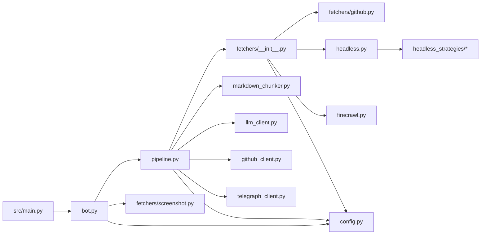
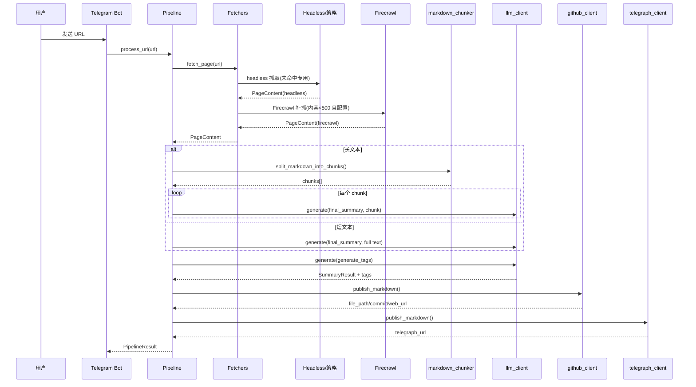

# websum_to_git 模块详细文档

> **导航**: [← 返回项目根目录 CLAUDE.md](../../CLAUDE.md)  
> **更新时间**: 2025-12-10T01:00:11+08:00

本目录包含 WebSum-To-Git 的核心逻辑（Bot 入口、抓取、摘要、发布）。

---

## 包概览

---

## 模块详解

### config.py - 配置管理

- dataclass: `LLMConfig`（provider/base_url/enable_thinking/max_input_tokens），`GitHubConfig`，`TelegramConfig`，`FirecrawlConfig`，`HttpConfig`，聚合 `AppConfig`。
- `load_config(path)`：加载 YAML，构建 fast_llm（可选，用于标签/翻译）、firecrawl（可选）、http 配置；OpenAI/Responses 默认 base_url=`https://api.openai.com`。
- `_require` 校验必填字段；`max_input_tokens` 默认 10000。

### bot.py - Telegram 入口

- 命令：`/start`、`/help`、`/url2img <url>`；心跳文件写入 `/tmp/websum_bot_heartbeat`。
- 发送 URL：调用 `HtmlToObsidianPipeline.process_url`；完成后带删除按钮（回调 `delete_file`）。
- 截图：`capture_screenshot` 使用 Camoufox 全页截图。

### pipeline.py - 摘要/发布主流程

- 依赖：`fetchers.fetch_page`、`markdown_chunker`、`LLMClient`、`GitHubPublisher`、`TelegraphClient`。
- `process_url(url)` 步骤：
  1. Fetchers 路由抓取（专用 GitHub → Headless 策略 → Firecrawl 兜底，当 markdown < 500 字符且配置了 firecrawl）。
  2. `_summarize_page`：内容 < `MIN_CONTENT_FOR_SUMMARY`(500) 时跳过 LLM，仅保存原文；否则估算 tokens，短文一次总结，长文按 Markdown 分片总结并拼接。
  3. `_generate_tags`：用 fast_llm（若配置）生成标签。
  4. `_build_markdown`：front matter + 摘要；原文区一律一级标题，非中文先翻译再附原文；短内容提示“未生成 AI 摘要”；使用 fast_llm 翻译（分片）。
  5. GitHub 发布：`GitHubPublisher.publish_markdown`，文件名 `{timestamp}-{safe_title}.md`。
  6. Telegraph 发布（失败不致命），返回链接。
- 其他：`delete_file(file_path)` 供 Bot 删除按钮使用。

### fetchers 包概述

- 入口 `fetchers.fetch_page(url, config)`：
  1. 显式路由表（当前内置 GitHub 专用 fetcher）。
  2. Headless 兜底（Camoufox），命中策略注册表时可定制处理/提取/构建。
  3. Markdown 过短 (< `MIN_CONTENT_FOR_RETRY`=500) 且配置 firecrawl 时，尝试 Firecrawl 补抓。
- 常量：`MIN_CONTENT_FOR_RETRY`、`MIN_CONTENT_FOR_SUMMARY`（均 500 字符）。
- 公共结构：`PageContent`（pydantic BaseModel，url/final_url/title/text/markdown/raw_html/article_html），`FetchError`。
- 截图：`capture_screenshot(url)`（Camoufox，全页）。

#### headless.py + headless_strategies/*

- 使用 Camoufox（Firefox）抓取；默认后处理 `remove_overlays`（去 Cookie/弹窗），默认滚动触发懒加载。
- 路由注册：`headless_strategies.registry.route(pattern, timeout=None, wait_selector=None, scroll=True)` 装饰器，支持装饰函数（process_page）或类（process/extract/build）。
- `HeadlessConfig`：timeout / wait_selector / scroll；策略可覆盖 post_process、extract、build_content。
- 内置策略：
  - `TwitterStrategy`：等待 tweetText，不滚动；移除登录遮挡，提取作者/正文/互动/图片/视频/引用，构建 Markdown。
  - `process_huggingface`：检测 `iframe.space-iframe` 并跳转到真实应用页面，避免错误滚动。
- `camoufox_helper`：惰性加载、自动滚动、移除悬浮窗（点击接受按钮 + 移除常见选择器），Playwright 错误封装为 `FetchError`。
- `html_utils`：Readability 提取、相对链接转绝对、HTML→Markdown（ATX 标题）。

#### firecrawl.py

- `fetch_firecrawl(url, config)`：Firecrawl API 抓取 markdown/html（默认缓存 2 天），带 metadata 标题/最终 URL 兜底；未配置 API Key 抛 `FetchError`。

#### github.py

- 基于 PyGithub，路由正则：
  - 仓库主页 `/owner/repo`（含 `/tree`）：获取 README + 基本信息。
  - Issue/PR：正文 + 最多 10 条评论。
  - 代码文件：高亮语言探测（扩展名映射），输出代码块。
  - Gist：所有文件逐个输出。
- 依赖 `config.github.pat`（必填）与 HTTP verify_ssl。

#### screenshot.py

- `capture_screenshot(url, timeout=15, full_page=True)`：Camoufox 截图，完成后自动清理临时文件。

### markdown_chunker.py

- `split_markdown_into_chunks(text, max_tokens)`：按 Markdown 结构（标题/代码/列表/引用/表格/文本）分段计数。
- `estimate_token_length(text)`：tiktoken(cl100k_base) 估算。
- chunk 规则：遇标题换块、超长段落拆分、保持代码 fence 完整。

### llm_client.py

- Provider: `openai`、`openai-response`、`anthropic`、`gemini`。
- OpenAI：chat.completions，开启 thinking 时注入 extra_body（google/thinking/reasoning_effort），超时 30 分钟。
- Responses：responses.create，支持 reasoning.effort=high。
- Anthropic：messages.create，支持 thinking=True。
- Gemini：按模型自动配置 thinking_budget/level。
- fast_llm 与主 LLM 共享接口，用于标签与翻译。

### github_client.py

- `publish_markdown(content, source, title)`：生成 `{timestamp}-{safe_title}.md`，target_dir 可选；返回路径/commit/web_url。
- `delete_file(file_path)`：获取 SHA 后删除（Bot 删除按钮使用）。

### telegraph_client.py

- 首次调用自动创建匿名账户；`publish_markdown` 将 Markdown 转为 Telegraph 支持的 h3/h4/p/pre/blockquote 等标签（移除 front matter、简化行内格式），返回 url/path。

---

## 数据流（摘要模式）

---

## 扩展指南

- **新增 Headless 策略**：在 `fetchers/headless_strategies/custom.py` 中编写，使用 `@route("example.com", wait_selector="...")` 装饰函数或类；可选静态方法 `process`（页面清理）、`extract`（结构化数据）、`build`（自定义 PageContent）。
- **新增专用 Fetcher**：在 `fetchers/__init__.py` 的 `ROUTERS` 添加匹配器 → handler（签名 `handler(url, config) -> PageContent`）。
- **替换/新增 LLM Provider**：在 `config.py` 扩展 provider 值，`llm_client.py` 添加对应 `_generate_with_xxx`。
- **输出格式调整**：修改 `prompts/final_summary.md` 和 `pipeline._build_markdown` 模板。

---

## 测试建议

- fetchers/headless_strategies：Twitter 登录遮挡移除、HuggingFace Space 跳转、滚动/等待行为。
- fetchers/__init__：路由顺序、Firecrawl 兜底触发阈值、异常回退。
- fetchers/github.py：仓库/Issue/PR/文件/Gist 路由及缺失 README/评论边界。
- markdown_chunker.py：多级标题、长代码块、空文本、token 估算。
- pipeline.py：短内容跳过摘要/翻译分片/H1 原文标题/标签生成。
- bot.py：命令处理、删除回调、截图失败兜底。
- llm_client.py：各 provider 调用及 thinking 配置。
- github_client.py：文件发布/删除错误处理。
