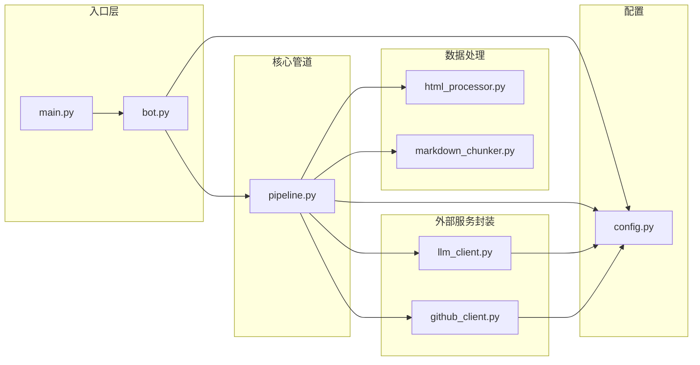
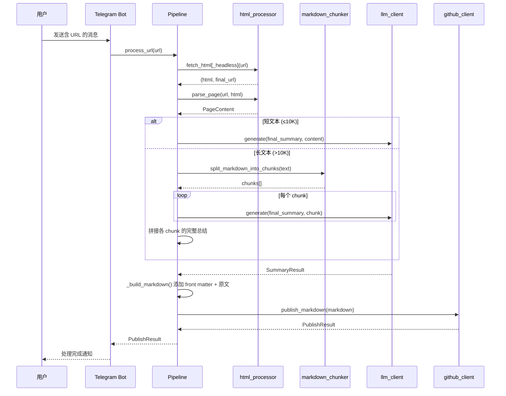

# websum_to_git 模块详细文档

> **导航**: [← 返回项目根目录 CLAUDE.md](../../CLAUDE.md)
> **更新时间**: 2025-11-26T17:59:25+08:00

本目录是 WebSum-To-Git 项目的核心 Python 包，包含所有业务逻辑模块。

---

## 模块概览



---

## 各模块详解

### 1. config.py - 配置管理

**职责**: 定义配置数据模型，从 YAML 文件加载并校验配置。

**关键导出**:
| 符号 | 类型 | 说明 |
|------|------|------|
| `LLMConfig` | dataclass | LLM 服务配置 (provider, api_key, model, base_url, enable_thinking) |
| `GitHubConfig` | dataclass | GitHub 仓库配置 (repo, branch, target_dir, pat) |
| `TelegramConfig` | dataclass | Telegram Bot 配置 (bot_token) |
| `HttpConfig` | dataclass | HTTP 抓取配置 (verify_ssl, fetch_mode) |
| `AppConfig` | dataclass | 顶层配置聚合 |
| `load_config(path)` | function | 从 YAML 文件加载配置 |

**内部函数**:
- `_require(mapping, key)`: 校验必填字段，缺失时抛出 `ValueError`

**依赖**: `yaml`, `pathlib`

**使用示例**:
```python
from websum_to_git.config import load_config
config = load_config("config.yaml")
print(config.llm.provider)  # "openai"
```

---

### 2. bot.py - Telegram Bot 入口

**职责**: 处理 Telegram 消息，提取 URL 并调用核心管道。

**关键导出**:
| 符号 | 类型 | 说明 |
|------|------|------|
| `TelegramBotApp` | class | Bot 应用主类 |
| `run_bot(config_path)` | function | 启动 Bot 轮询 |
| `extract_first_url(text)` | function | 从文本中提取第一个 URL |

**类: TelegramBotApp**
- `__init__(config: AppConfig)`: 初始化 Bot 和 Pipeline
- `start(update, context)`: 处理 /start 命令
- `handle_message(update, context)`: 处理普通文本消息

**处理流程**:
1. 从消息文本中通过正则提取第一个 `http(s)://` URL
2. 异步调用 `pipeline.process_url(url)` 处理
3. 返回处理结果给用户

**依赖**: `telegram`, `asyncio`, `re`

---

### 3. pipeline.py - 核心处理管道

**职责**: 编排完整的 HTML→LLM→Markdown→GitHub 流程。

**关键导出**:
| 符号 | 类型 | 说明 |
|------|------|------|
| `HtmlToObsidianPipeline` | class | 核心管道类 |

**类: HtmlToObsidianPipeline**
- `__init__(config: AppConfig)`: 初始化各子组件
- `process_url(url) -> PublishResult`: 主入口，处理 URL 并发布到 GitHub

**核心常量**:
- `_MAX_INPUT_TOKENS = 4000`: 单次 LLM 请求最大输入 token 数
- `_PROMPTS_DIR`: 提示词文件目录路径

**内部方法**:
- `_load_prompt(name: str) -> str`: 从 prompts 目录加载提示词文件
- `_parse_summary_result(raw_output: str) -> SummaryResult`: 解析 LLM 输出为标题+内容
- `_summarize_page(page: PageContent) -> SummaryResult`:
  - 短文本 (≤10K字符): 一次性使用 `final_summary.md` 总结
  - 长文本: 每个 chunk 独立使用 `final_summary.md` 生成完整总结，然后拼接
- `_generate_tags(title, summary_content) -> list[str]`: 调用 AI 生成 3-5 个标签
- `_is_chinese_text(text) -> bool`: 检测文本是否主要为中文
- `_translate_to_chinese(text) -> str`: 将非中文文本翻译为中文
- `_build_markdown(page, summary_result) -> str`:
  - 生成 YAML front matter（含 tags）+ AI 总结 + 原文（非中文时附带翻译）

**输出格式**:
```markdown
---
source: https://example.com/article
created_at: 2025-11-26T10:00:00+00:00
title: 文章标题
tags:
  - ClaudeCode
  - Python
  - FastAPI
---

# AI精炼标题

> 摘要 ...

## 1. 核心概念与术语
...

## 2. 核心逻辑与内容拆解
...

---

## 原文
（中文原文直接输出）

---
（或非中文原文时）
## 原文（中文翻译）
（AI 翻译的中文版本）

---

## 原文（原语言）
（保留的原语言内容）
```

**依赖**: `html_processor`, `llm_client`, `github_client`, `markdown_chunker`

---

### 4. html_processor.py - 网页抓取与解析

**职责**: 获取网页 HTML 内容，提取正文并转换为 Markdown。

**关键导出**:
| 符号 | 类型 | 说明 |
|------|------|------|
| `PageContent` | dataclass | 网页内容数据结构 |
| `fetch_html(url, timeout, verify)` | function | 使用 requests 抓取 |
| `fetch_html_headless(url, timeout)` | function | 使用 Playwright 抓取 |
| `parse_page(url, html, final_url)` | function | 解析 HTML 提取正文 |
| `HeadlessFetchError` | exception | Headless 抓取异常 |

**dataclass: PageContent**
```python
@dataclass
class PageContent:
    url: str           # 原始请求 URL
    final_url: str     # 最终 URL (可能重定向)
    title: str         # 网页标题
    text: str          # 纯文本 (用于 LLM)
    markdown: str      # Markdown 格式正文
    raw_html: str      # 原始完整 HTML
    article_html: str  # Readability 提取后的文章 HTML
```

**核心流程**:
1. `fetch_html[_headless]`: 获取原始 HTML
2. `parse_page`:
   - 使用 `readability-lxml` 提取正文 HTML
   - 使用 `markdownify` 转换为 Markdown
   - 使用 `BeautifulSoup` 提取纯文本

**内部函数**:
- `_html_to_markdown(html)`: markdownify 封装，配置 ATX 风格标题

**依赖**: `requests`, `playwright`, `beautifulsoup4`, `readability-lxml`, `markdownify`

---

### 5. markdown_chunker.py - Markdown 分段器

**职责**: 将长 Markdown 文本按 token 限制分割为多个 chunk。

**关键导出**:
| 符号 | 类型 | 说明 |
|------|------|------|
| `split_markdown_into_chunks(text, max_tokens)` | function | 主分割函数 |
| `estimate_token_length(text)` | function | 估算文本 token 长度 |
| `ParagraphBlock` | dataclass | 段落块数据结构 |
| `ParagraphKind` | Literal | 段落类型枚举 |

**段落类型 (ParagraphKind)**:
- `heading`: 标题行 (`# ## ###` 等)
- `code`: 代码块 (``` 或 ~~~)
- `list`: 列表项 (`- * +` 或数字列表)
- `quote`: 引用块 (`>`)
- `table`: 表格行 (`|...|`)
- `text`: 普通文本

**分割策略**:
1. **段落切分**: 按 Markdown 结构 (标题/代码块/列表/引用/表格/文本) 切分
2. **Chunk 构建**:
   - 按 token 计数拼接段落
   - 遇到标题时强制开启新 chunk
   - 超长段落单独拆分
3. **代码块处理**: 保持 fence marker 完整性
4. **Token 计数**: 使用 tiktoken (cl100k_base 编码)

**内部函数**:
- `_split_into_paragraphs(text)`: 切分段落
- `_build_chunks(paragraphs, max_tokens)`: 构建 chunk 列表
- `_split_plain_text_chunks(text, max_len)`: 按行拆分超长文本
- `_split_code_block_chunks(paragraph, max_len)`: 拆分超长代码块
- `_estimate_token_length(text)`: tiktoken 估算
- `_hard_split_by_tokens(text, max_len)`: 强制按 token 拆分

**依赖**: `tiktoken`, `re`

---

### 6. llm_client.py - 多厂商 LLM 客户端

**职责**: 统一封装 OpenAI / Anthropic / Gemini API 调用。

**关键导出**:
| 符号 | 类型 | 说明 |
|------|------|------|
| `LLMClient` | class | 统一 LLM 调用接口 |

**类: LLMClient**
- `__init__(config: LLMConfig)`: 初始化对应 SDK 客户端
- `generate(system_prompt, user_content) -> str`: 生成文本

**支持的 Provider**:
| Provider | SDK | 说明 |
|----------|-----|------|
| `openai` | openai | OpenAI 官方/兼容 API (chat.completions) |
| `openai-response` | openai | OpenAI Responses API |
| `anthropic` | anthropic | Anthropic Messages API |
| `gemini` | google-generativeai | Google Gemini API |

**内部方法**:
- `_generate_with_openai(system_prompt, user_content)`: chat.completions，支持通过 extra_body 传递 thinking 配置
- `_generate_with_openai_response(system_prompt, user_content)`: responses API，通过 reasoning.effort 控制推理
- `_generate_with_anthropic(system_prompt, user_content)`: messages API，通过 thinking 参数启用
- `_generate_with_gemini(system_prompt, user_content)`: generate_content，通过 ThinkingConfig 控制

**默认参数**:
- `temperature = 1.0` (支持 thinking 模式)
- `max_tokens = 32000` (仅 Anthropic)
- `enable_thinking = True` (默认启用推理/思考功能)

**Thinking 功能支持**:
| Provider | 启用方式 | 说明 |
|----------|----------|------|
| `openai` | extra_body.thinking | 通过 google/thinking/reasoning_effort 配置 |
| `openai-response` | reasoning.effort | high (启用) / none (禁用) |
| `anthropic` | thinking=True | 启用扩展思考模式 |
| `gemini` | ThinkingConfig | 2.5-pro: budget=32768, 2.5-flash: budget=19660, 3-pro: HIGH |

**依赖**: `openai`, `anthropic`, `google-generativeai`

---

### 7. github_client.py - GitHub 发布客户端

**职责**: 通过 GitHub API 创建文件并提交。

**关键导出**:
| 符号 | 类型 | 说明 |
|------|------|------|
| `GitHubPublisher` | class | GitHub 发布器 |
| `PublishResult` | dataclass | 发布结果 |

**dataclass: PublishResult**
```python
@dataclass
class PublishResult:
    file_path: str       # 创建的文件路径
    commit_hash: str     # Commit SHA (可能为 None)
```

**类: GitHubPublisher**
- `__init__(config: GitHubConfig)`: 初始化 session
- `publish_markdown(content, source, title) -> PublishResult`: 发布 Markdown 文件

**文件命名规则**:
```
{timestamp}-{safe_title}.md
例: 20251126-143052-Getting-Started-with-Python.md
```

**API 调用**:
- 使用 GitHub Contents API (`PUT /repos/{owner}/{repo}/contents/{path}`)
- 内容通过 Base64 编码传输
- 自动生成 commit message: `Add note from {source} at {timestamp}`

**依赖**: `requests`, `base64`

---

### 8. __init__.py - 包导出

**职责**: 定义包的公开接口。

**导出**: `main` 函数 (从 `main.py` 间接导出)

---

## 数据流图



---

## 扩展指南

### 添加新的 LLM Provider

1. 在 `config.py` 中确认 `LLMConfig.provider` 字段支持新值
2. 在 `llm_client.py` 中:
   - `__init__`: 添加新 provider 的客户端初始化
   - `generate`: 添加路由分支
   - 实现 `_generate_with_{provider}` 方法
3. 更新 `config.example.yaml` 和相关文档

### 修改 Markdown 输出格式

1. 修改 `prompts/final_summary.md`: 总结提示词
2. 修改 `pipeline.py` 中的 `_build_markdown`: 输出模板

### 添加新的抓取模式

1. 在 `config.py` 的 `HttpConfig` 中添加新模式
2. 在 `html_processor.py` 中实现新的 `fetch_html_{mode}` 函数
3. 在 `pipeline.py` 的 `process_url` 中添加模式分支

---

## 测试建议

当前项目未包含自动化测试。建议的测试重点:

| 模块 | 测试重点 |
|------|---------|
| `config.py` | 必填字段校验、默认值、类型转换 |
| `html_processor.py` | 各类网页解析、重定向处理、异常情况 |
| `markdown_chunker.py` | 边界情况 (空文本、超长、复杂嵌套) |
| `llm_client.py` | Mock API 响应、错误处理 |
| `github_client.py` | Mock API、文件命名、编码 |
| `pipeline.py` | 端到端集成测试 |

---

> **导航**: [← 返回项目根目录 CLAUDE.md](../../CLAUDE.md)
